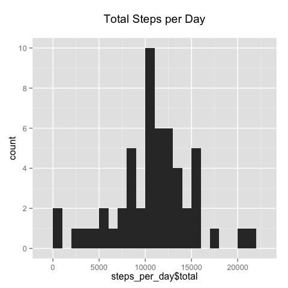
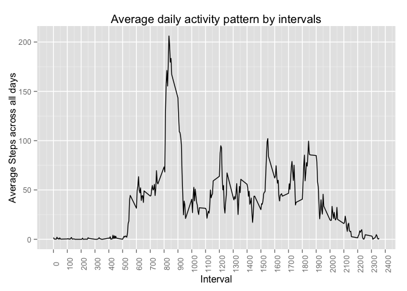
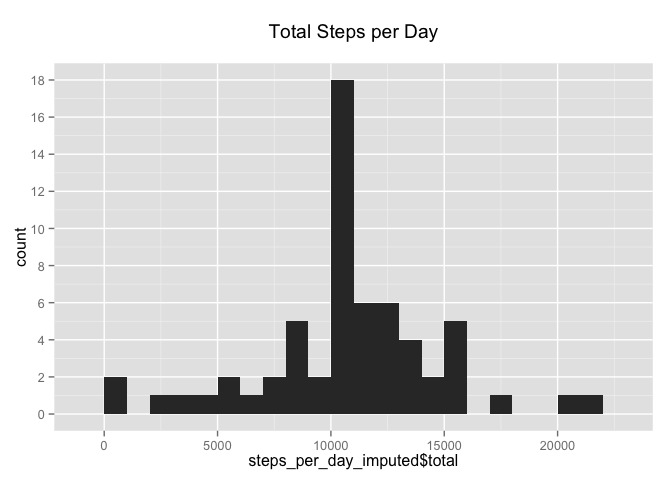
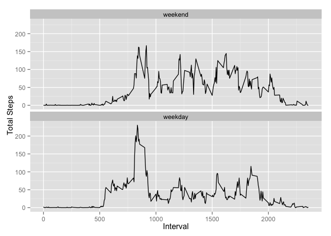

# Reproducible Research: Peer Assessment 1


## Loading and preprocessing the data


```r
#Set working directory
setwd("~/Coursera/Data Science/Reproducible Research/RepData_PeerAssessment1")

#Load data 
if(!file.exists("activity.csv")){
  unzip("activity.zip")
}

activity_data <- read.csv("activity.csv")
```


## What is mean total number of steps taken per day?


```r
library(ggplot2)
```

```
## Warning: package 'ggplot2' was built under R version 3.1.3
```

```r
library(dplyr)
```

```
## 
## Attaching package: 'dplyr'
## 
## The following object is masked from 'package:stats':
## 
##     filter
## 
## The following objects are masked from 'package:base':
## 
##     intersect, setdiff, setequal, union
```

```r
library(tidyr)
library(stringr)
```


```r
#Total Steps per day
steps_per_day <- activity_data %>% 
                    select(date,steps) %>% 
                    filter(!is.na(steps)) %>% 
                    group_by(date) %>% 
                    summarise(total=sum(steps)) 

ggplot(data = steps_per_day, aes(steps_per_day$total)) + 
  geom_histogram(binwidth=1000) +
  ggtitle('Total Steps per Day\n') +
  scale_y_continuous(breaks = seq(0, 10, by = 2))
```

 

```r
m <- round(mean(steps_per_day$total),2)
med <- round(median(steps_per_day$total),2)
```

Mean Total Number of Steps per day is 1.076619\times 10^{4}.  
Median Total Number of Steps per day is 1.0765\times 10^{4}.

## What is the average daily activity pattern?


```r
#Average steps taken per interval
avg_steps_per_interval <- activity_data %>% 
                                select(interval,steps) %>% 
                                filter(!is.na(steps)) %>% 
                                group_by(interval) %>% 
                                summarise(avg=round(mean(steps),2))

ggplot(data = avg_steps_per_interval, aes(x=interval, y=avg)) +
  geom_line() +
  ggtitle("Average daily activity pattern by intervals")+
  xlab("Interval") +
  ylab("Average Steps across all days")  +
  scale_x_continuous(breaks = seq(0, 2400, by = 100)) +
  theme(axis.text.x=element_text(angle=90))
```

 


```r
#Most active interval on average
most_active_interval <- avg_steps_per_interval %>%
                          arrange(desc(avg)) %>%
                          top_n(1) %>%
                          select(interval)
```

```
## Selecting by avg
```

The interval with the highest average steps is 835.

## Imputing missing values

```r
#Calculating missing values
missing_values <- activity_data %>% 
                    summarise(missing_steps = sum(is.na(steps)),
                              missing_intervals = sum(is.na(interval)),
                              missing_dates = sum(is.na(date)))
```

The number of missing values in each column is:

```r
missing_values           
```

```
##   missing_steps missing_intervals missing_dates
## 1          2304                 0             0
```

Imputing missing values in the steps variable is achieved by taking the mean of the five minute interval across all days.


```r
#imputing missing values
activity_data_imputed <- activity_data %>% 
                                    left_join (avg_steps_per_interval, by = 'interval') %>%
                                    transmute (steps = ifelse(is.na(steps),avg, steps),
                                                date = date,
                                                interval = interval
                                              )
#Total Steps per day
steps_per_day_imputed <- activity_data_imputed %>% 
                                      select(date,steps) %>% 
                                      group_by(date) %>% 
                                      summarise(total=sum(steps)) 

#Histogram
ggplot(data = steps_per_day_imputed, aes(steps_per_day_imputed$total)) + 
  geom_histogram(binwidth=1000) +
  ggtitle('Total Steps per Day\n') +
  scale_y_continuous(breaks = seq(0, 20, by = 2))
```

 

```r
m.i <- round(mean(steps_per_day_imputed$total),2)
med.i <- round(median(steps_per_day_imputed$total),2)
```

After imputation of missing steps, mean is 1.076618\times 10^{4} and median is 1.076613\times 10^{4}. 
By using the above method mean and median remained unchanged.

## Are there differences in activity patterns between weekdays and weekends?


```r
#convert date to DATE type
activity_data_imputed$date <- as.POSIXct(as.Date(activity_data_imputed$date, '%Y-%m-%d'))

# new variable for day
activity_data_imputed$day <- factor( ifelse(weekdays(activity_data_imputed$date, abbreviate = TRUE) %in% c('Sat','Sun'), 'weekend', 'weekday'), levels=c('weekend', 'weekday'))

steps_on_weekdays <- activity_data_imputed %>%
  group_by(interval, day) %>%
  summarise(steps_avg = mean(steps))

ggplot(data = steps_on_weekdays, aes(x=interval, y=steps_avg)) +
  geom_line() + 
  facet_wrap(~ day, ncol = 1) +
  ylab('Total Steps') +
  xlab('Interval')
```

 
